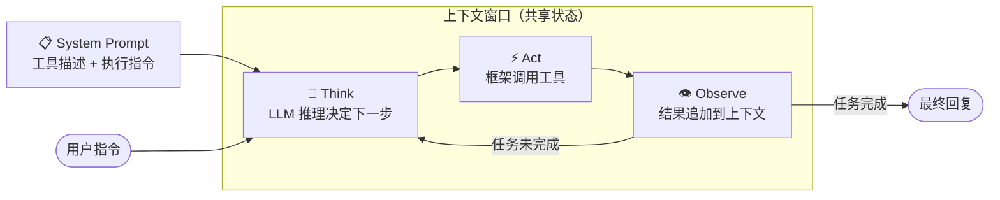

> **来源**：HuggingFace Agents Course Unit 1–4
> **作者**：HuggingFace 团队
> **链接**：[https://huggingface.co/learn/agents-course](https://huggingface.co/learn/agents-course)
> **关键词**：`AI Agent` `LLM` `Tools` `ReAct` `Think-Act-Observe` `smolagents`
> **一句话**：AI Agent = LLM（大脑）＋ Tools（手脚）＋ Think-Act-Observe 循环，这三件事想清楚，Agent 的本质就通了。

---

## TL;DR

**一句话总结**：Agent 是给 LLM 装上手脚和反馈回路的系统——它不只回答问题，还能拆解任务、调用工具、根据结果迭代，直到把事情真正做完。

**三点拆解**：

- 🔑 **Agent 的本质是"有自主权的 LLM"**：普通 LLM 是一问一答，Agent 多了一个 while 循环。这个差异是质的——单工具 Agent 只能查天气，多工具+多轮循环的 Agent 能完成"查竞品→写分析报告→自动发送邮件"的完整链路，中间不需要人介入。

- 🔑 **Tools 是 Agent 超越训练数据的唯一出路**：LLM 的知识截止到训练截止日，且无法执行任何操作。实时信息、代码运行、文件操作，靠的不是模型本身，而是配备的工具。工具描述写得好不好，比换一个更贵的模型影响更大。

- 🔑 **Think-Act-Observe 是 Agent 工程的核心抽象**：smolagents 默认代码执行、LangGraph 显式建图、LlamaIndex 以数据索引为中心——三者的差异本质上是对循环中 Act 环节的不同约束策略，内核是同一个循环。

---

## 背景与动机：LLM 能聊，但为什么不能"干活"？

LLM 有三个硬边界——训练知识截止、无法调用外部系统、单轮即终——这不是模型能力问题，而是设计边界：一个 token 预测器本来就不应该发邮件。

这三个边界带来三个具体的工程问题：

1. **知识截止**：训练数据有时效，无法获取实时信息，强答就是幻觉
2. **无法执行**：能写代码，但不能运行；能写邮件，但不能发送
3. **一轮即终**：每次对话独立，无法持续迭代直到任务完成

工程上解决这三个问题的答案，就是 **Agent**。

---

## 核心 Idea：LLM + Tools + 循环 = Agent

💡 **核心类比**：Agent 就像一个配了整套厨房设备的主厨——LLM 是主厨的大脑（规划菜谱、决定下一步），Tools 是灶台、刀具、烤箱（执行具体操作），Think-Act-Observe 循环是做菜的过程：想好→动手→尝一口→再调整，直到菜端上桌。



**关键分工（也是最容易被误解的地方）：**

- **Think**：LLM 读取上下文窗口中的全部内容（System Prompt + 历史消息 + 历史 Observation），输出文本——"下一步应该调用 `get_weather`，参数是 `city='北京'`"
- **Act**：**框架**解析 LLM 的输出，实际调用对应工具。LLM 本身不执行任何代码，它只产生文字
- **Observe**：工具的返回值被追加到上下文窗口，LLM 在下一轮 Think 时读到它

**LLM 从不执行任何东西。** 所有"执行"都由框架层完成。这个认知是理解 Agent 架构设计的起点。

---

## 方法拆解：从 Token 到 Agent，五个层次

### 第一层：LLM——预测机器，不是理解机器

现代 LLM 几乎都是 **Decoder-only Transformer**（GPT-4、Llama 3、Qwen 都是）。核心操作极简：**给定前面所有 token，预测下一个 token 的概率分布**，重复直到输出 EOS。

Transformer 的 **Attention 机制**决定了每次预测时哪些 token 被重点关注。这在 Agent 场景中有一个直接的工程含义：**工具描述、历史工具调用结果、当前 Observation 都在争夺 LLM 的注意力**。上下文越长，越靠前的内容越容易被"遗忘"，这是 Agent 在多轮循环中可靠性下降的根本原因之一。

### 第二层：Chat Template——对话进入 LLM 的唯一通道

你在界面上看到的"对话"是 UI 抽象。模型每次收到的是一段拼接好的纯文本串——所有历史消息序列化成一个长字符串，一次性输入。

Chat Template 存在的根本原因是：**模型在训练时见到的格式是固定的，推理时偏离训练格式会导致模型行为不可预期。** 这不是工程习惯，是模型行为的硬约束。

```python
from transformers import AutoTokenizer

messages = [
    {"role": "system",    "content": "你是一个专业的客服助手。"},
    {"role": "user",      "content": "我的订单 ORDER-123 出了问题"},
    {"role": "assistant", "content": "您好，请问是什么问题？"},
    {"role": "user",      "content": "一直显示配送中，三天了"},
]

tokenizer = AutoTokenizer.from_pretrained("HuggingFaceTB/SmolLM2-1.7B-Instruct")
prompt = tokenizer.apply_chat_template(messages, tokenize=False, add_generation_prompt=True)

print(prompt)
# <|im_start|>system
# 你是一个专业的客服助手。<|im_end|>
# <|im_start|>user
# 我的订单 ORDER-123 出了问题<|im_end|>
# <|im_start|>assistant
# 您好，请问是什么问题？<|im_end|>
# <|im_start|>user
# 一直显示配送中，三天了<|im_end|>
# <|im_start|>assistant
```

不同模型 Special Token 各不相同（Llama 3 用 `<|eot_id|>`，Gemma 用 `<end_of_turn>`）。用错 Chat Template 是工程上最常见的坑之一。

**System Prompt 在 Agent 中的额外职责**：不只设置"角色"，还要注入可用工具的文字描述、输出格式规范（JSON 还是代码块）、以及 Think-Act-Observe 的执行指令。System Prompt 是 Agent 的"操作手册"。

### 第三层：Tools——突破知识和执行边界

工具的本质：**一个有名字、有类型标注、有文字描述的 Python 函数**。LLM 读描述决定何时调用，框架读代码实际执行。

工具描述之所以用自然语言而非纯 JSON Schema，是因为 LLM 做的是语言概率推断，不是 API 路由查找。一个写着 `"获取指定城市当前天气"` 的描述，和写着 `"get_weather(city: str)"` 的描述，LLM 激活的语义路径完全不同——前者在"用户说下雨要带伞"时更可能被联想到。描述质量直接决定 LLM 是否能在正确时机调用正确工具。

用 `@tool` 装饰器可以自动从函数签名生成工具描述：

```python
import inspect

def tool(func):
    """将 Python 函数包装成 Agent 可用的工具"""
    signature = inspect.signature(func)
    arguments = [
        (p.name, p.annotation.__name__
         if p.annotation != inspect.Parameter.empty else "Any")
        for p in signature.parameters.values()
    ]
    return_ann = signature.return_annotation
    outputs = (return_ann.__name__
               if return_ann != inspect.Parameter.empty else "Any")

    func.to_string = lambda: (
        f"Tool Name: {func.__name__}, "
        f"Description: {func.__doc__}, "
        f"Arguments: {', '.join(f'{n}: {t}' for n, t in arguments)}, "
        f"Outputs: {outputs}"
    )
    return func

@tool
def get_weather(city: str) -> str:
    """获取指定城市的当前天气信息"""
    return f"{city}: 晴，25°C，湿度 40%"   # 此处为演示用 mock 实现

# LLM 看到的工具描述（注入 System Prompt 的内容）
print(get_weather.to_string())
# Tool Name: get_weather, Description: 获取指定城市的当前天气信息, Arguments: city: str, Outputs: str

# 框架实际执行工具时的结果（Observation）
print(get_weather("北京"))
# 北京: 晴，25°C，湿度 40%
```

**MCP（Model Context Protocol）** 解决的是工具可移植性问题：标准化工具描述和调用方式，让 smolagents 写的工具可以直接在 LangGraph 里用，不用为每个框架重写一遍。

### 第四层：Actions——LLM 如何"下指令"

LLM 不执行，只生成文本指令。两种格式的分歧来自一个工程张力：**JSON 格式对框架友好**（字段明确、易解析、出错可定位），**Code 格式对 LLM 友好**（与训练数据中大量代码对齐，复杂组合逻辑表达力更强）。选哪种，本质是在"框架可控性"和"模型表达力"之间权衡。

**JSON Agent**（通用，易解析）：
```json
Thought: 用户需要北京天气，应该调用 get_weather 工具。
Action: {
  "action": "get_weather",
  "action_input": {"city": "北京"}
}
```

**Code Agent**（更强，可写循环/条件/多工具组合，但安全风险高，需沙箱）：
```python
result = get_weather("北京")
print(f"当前天气：{result}")
```

两种方式的共同机制是 **Stop and Parse**：LLM 输出完整 Action 后**必须停止生成**，框架接管执行，结果作为 Observation 追加回上下文。LLM 无法自己"假装"工具已执行——一旦让它继续生成，它只会凭空捏造一个"结果"。

### 第五层：完整循环——成功路径与失败路径

```
┌─────────────────────────────────────────────────────────────────┐
│                      Think-Act-Observe 循环                      │
│                                                                 │
│   用户指令 ──→ [Think] ──→ [Act] ──→ [Observe]                  │
│                  ↑                       │                      │
│                  │          ┌────────────┴────────────┐         │
│                  │          ↓                         ↓         │
│                  │     工具成功返回              工具失败/异常     │
│                  │          │                         │         │
│                  │     任务完成？                 错误信息        │
│                  │     ┌────┴────┐            追加到上下文       │
│                  │     ↓        ↓                     │         │
│                  │   Yes       No ──────────────────→ ┘         │
│                  │     │                                        │
│                  │     ↓                                        │
│               [Final Reply]                                     │
└─────────────────────────────────────────────────────────────────┘
```

**成功路径：**
```
用户:      "纽约现在天气怎样？"

[Thought]  "用户要实时天气，训练数据没有今天的信息，应该调用 get_weather。"

[Action]   框架执行: get_weather(city="New York")
           返回:     "纽约：多云，15°C，湿度 60%"

[Observe]  "已获得天气数据，任务达成。"

[Final]    "纽约目前多云，气温 15°C，湿度 60%。"
```

**失败路径（工具调用出错，循环继续）：**
```
[Action]   框架执行: get_weather(city="New York")
           返回:     ConnectionError: timeout after 5s  ← 出错

[Observe]  "工具调用失败: timeout，将重试。"

[Thought]  "调用超时，重试一次或改用缓存数据。"

[Action]   框架执行: get_weather(city="New York")      ← 重试
           返回:     "纽约：多云，15°C，湿度 60%"
```

这里有一个被大多数入门课程忽略的陷阱——自我纠错只对确定性错误有效，见批判性分析。

---

## 框架速览：三条路，一个循环

Unit 2 介绍的三大框架，本质上都是 Think-Act-Observe 循环的不同封装：

| 框架 | 核心差异 | 适用场景 |
|------|---------|---------|
| **smolagents** | 默认 Code Agent（LLM 输出可执行 Python，框架在沙箱中运行，工具组合灵活但安全边界是刚需） | 快速原型，本地模型，代码执行类任务 |
| **LlamaIndex** | 以数据索引为中心（RAG 是一等公民，检索结果直接作为 Observation 注入循环） | 知识库问答，文档处理，生产级 RAG |
| **LangGraph** | 显式建图（节点=步骤，边=流转条件，状态可持久化，工作流可可视化） | 复杂多步工作流，Multi-Agent，需精确控制流 |

粗略选框架的原则：工具调用需求简单→smolagents；核心是检索+生成→LlamaIndex；工作流复杂、需要可视化状态管理→LangGraph。

---

## 批判性分析

### Think-Act-Observe 的自我纠错能力被严重高估

课程把"工具调用失败→循环继续→Agent 自我纠错"作为 Agent 优于 LLM 的核心论据。这个描述只对了一半。

**自我纠错只在确定性错误上有效**：工具返回 `404`、网络超时、参数类型错误——这些异常会触发明确的 Observation，LLM 能识别并重试。但 LLM 幻觉导致的错误 Observation **解读**完全不同：工具正常返回了数据，LLM 却把"纽约气温 15°C"理解成了"用户问的是上海"，然后带着这个错误前提继续执行，循环不会中断，错误会被放大。这不是边缘情况，而是开放域任务中的常态。

课程没有提供任何关于"如何识别 LLM 误解了 Observation"的机制——没有置信度评估、没有结果验证、没有人工介入点。生产级 Agent 必须在循环之外加一层"不信任 LLM 解读"的防护，但入门课程完全跳过了这个问题。

### 成本和延迟是 Agent 可用性的隐形杀手

Think-Act-Observe 每轮至少一次 LLM 调用。一个需要 5 轮的任务，API 费用和端到端延迟是单次调用的 5 倍。对于 GPT-4o 级别的模型，这意味着一次"查竞品+写报告"任务可能花费数美元、等待数分钟。

课程把 Agent 包装成了一个"能自动完成复杂任务"的美好愿景，但没有给出任何关于循环步数控制、模型降级策略（复杂推理用强模型，简单工具调用用弱模型）、或任务分解来减少循环次数的工程思路。这些问题在把 Agent 从 demo 推向生产时，往往比"选哪个框架"更重要。

### 工具设计才是被低估的核心变量

HuggingFace 这门课最值得点名的盲区：**它花了大量篇幅讲如何用框架，却几乎没讲如何设计好工具**。工具的粒度、描述的精确性、错误返回的格式——这些决定了 LLM 能不能在正确时机调用正确工具、能不能从失败中恢复。换一个更强的模型带来的提升，往往不如把工具描述从 10 个词写到 30 个词来得实际。

```python
import inspect

def tool(func):
    signature = inspect.signature(func)
    func.to_string = lambda: f"Tool Name: {func.__name__}, Description: {func.__doc__}"
    func.__call__ = func
    return func

# 低质量描述：LLM 很难判断何时、为何调用这个工具
@tool
def fetch(q: str) -> str:
    """fetch data"""
    return "mock data"

# 高质量描述：触发条件、适用场景、数据边界三件事说清楚
@tool
def search_recent_news(query: str) -> str:
    """搜索过去 24 小时内与 query 相关的新闻标题和摘要。
    适用于：需要实时信息、训练数据截止日期之后发生的事件。
    不适用于：历史事件、数学计算、代码生成。
    返回：最多 5 条新闻，每条包含标题 + 来源 + 一句话摘要。"""
    return "[1] 标题: OpenAI 发布 GPT-5 | 来源: TechCrunch | 摘要: OpenAI 今日宣布..."

# LLM 看到的描述（注入 System Prompt 的内容）对比：
print(fetch.to_string())
# Tool Name: fetch, Description: fetch data

print(search_recent_news.to_string())
# Tool Name: search_recent_news, Description: 搜索过去 24 小时内与 query 相关的新闻标题和摘要。...

# 实际调用结果（Observation）对比：
print(fetch("OpenAI news"))
# mock data

print(search_recent_news("OpenAI"))
# [1] 标题: OpenAI 发布 GPT-5 | 来源: TechCrunch | 摘要: OpenAI 今日宣布...
```

描述的差距不只是"可读性"问题——对 LLM 来说，描述决定了语义激活路径：当用户说"帮我看看今天有没有关于 OpenAI 的新闻"，只有高质量描述才能让模型联想到"这需要实时信息→应该调用 `search_recent_news`"，而不是茫然生成一段幻觉文字。

---

## 应用落地 + 相关工作 + 资源

**三个真实落地场景：**
- **客服自动化**：Agent 接入 CRM + 知识库，处理"查订单→退款申请"这类多步操作，而不只是 FAQ 问答
- **代码辅助 Agent**：写代码→执行→读报错→修复，循环驱动，比单次代码生成实用一个数量级
- **研究助理**：web_search + PDF 阅读工具组合，自主完成"找论文→读摘要→提炼要点→输出报告"

**相关工作：**

| 工作/概念 | 与本文的核心区别 |
|----------|----------------|
| ReAct 论文（Yao et al., 2022） | Think-Act-Observe 的学术起源，本课是其工程化实践版 |
| OpenAI Function Calling | JSON Agent 的一个特化实现，强绑定 OpenAI API |
| AutoGen（Microsoft） | 专注 Multi-Agent 对话框架，本课 Multi-Agent 部分相对简略 |

**学习资源：**
- 课程主页：[HuggingFace Agents Course](https://huggingface.co/learn/agents-course)
- smolagents 安全沙箱文档：[secure_code_execution](https://huggingface.co/docs/smolagents/tutorials/secure_code_execution)
- MCP 协议课程：[HuggingFace MCP Course](https://huggingface.co/learn/mcp-course)
- ReAct 原论文：[arxiv.org/abs/2210.03629](https://arxiv.org/abs/2210.03629)
- 本文配套代码：[code/day0_agent_basics.py](./code/day0_agent_basics.py)

Agent 这个方向现在的状态，有点像 2015 年的深度学习：核心抽象已经稳定，工程工具链还在剧烈演化，很多今天的"最佳实践"明年可能就过时了。但不管框架怎么变，有三个问题永远得回答：模型怎么 Think、怎么 Act、以及——最容易被忽视的——怎么判断 Observe 到的结果是不是可信的。
