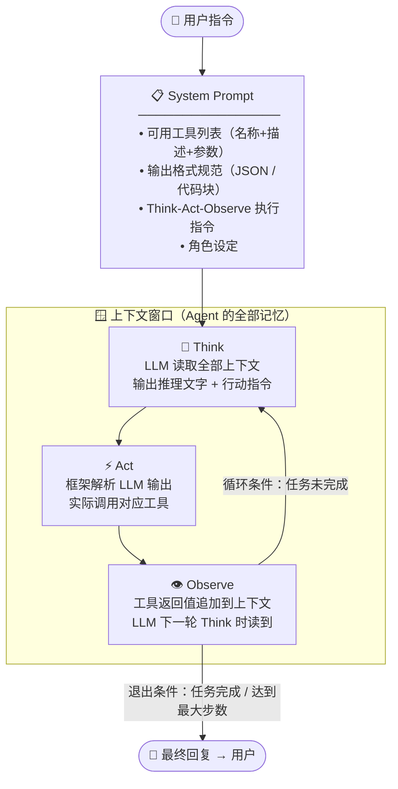
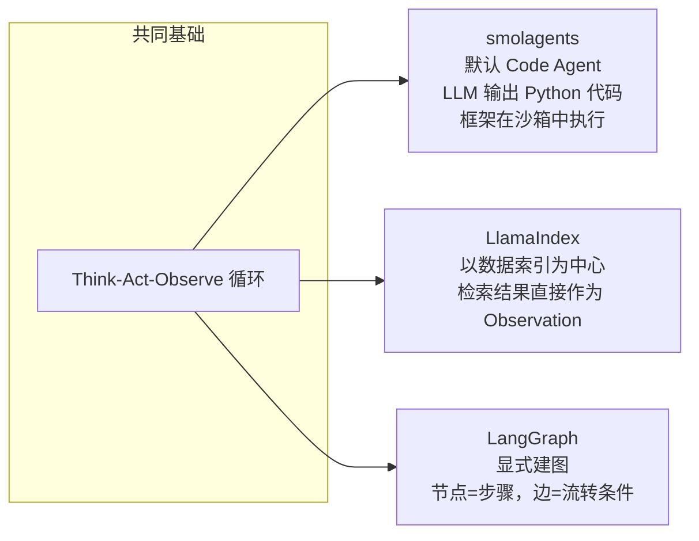

> **来源**：HuggingFace Agents Course Unit 1–4
> **作者**：HuggingFace 团队
> **链接**：[https://huggingface.co/learn/agents-course](https://huggingface.co/learn/agents-course)
> **关键词**：`AI Agent` `LLM` `Tools` `ReAct` `Think-Act-Observe` `smolagents` `LangGraph`
> **一句话**：AI Agent = LLM（大脑）＋ Tools（手脚）＋ Think-Act-Observe 循环，这三件事想清楚，Agent 的本质就通了。

---

## TL;DR

**一句话总结**：Agent 是给 LLM 装上手脚和反馈回路的系统——它不只回答问题，还能拆解任务、调用工具、根据结果迭代，直到把事情真正做完。

**三点拆解**：

- 🔑 **Agent 的本质是"有自主权的 LLM"**：普通 LLM 是一问一答，Agent 多了一个 while 循环。这个差异是质的——单工具 Agent 只能查天气，多工具+多轮循环的 Agent 能完成"查竞品→写分析报告→自动发送邮件"的完整链路，中间不需要人介入。Agency 的多少，决定了它能独立承担多复杂的任务。

- 🔑 **Tools 是 Agent 超越训练数据的唯一出路**：LLM 的知识截止到训练截止日，且无法执行任何操作。实时信息、代码运行、文件操作，靠的不是模型本身，而是配备的工具。工具描述写得好不好，比换一个更贵的模型影响更大——这个结论很多人不相信，但大量工程实践证明了这一点。

- 🔑 **Think-Act-Observe 是 Agent 工程的核心抽象**：smolagents 默认代码执行、LangGraph 显式建图、LlamaIndex 以数据索引为中心——三者的差异本质上是对循环中 Act 环节的不同约束策略，内核是同一个循环。理解这个循环，就能在三个框架之间自由切换，不会被框架 API 绑架。

---

## 背景与动机：当 LLM 碰到"干活"这件事

### 一个理想场景

想象这样一个场景：你早上起来，对着手机说一句话："帮我整理一下本周所有竞品动态，写成分析报告发给产品团队。"

这件事对人来说并不复杂——搜索几个关键词、读几篇文章、打开文档写内容、发封邮件，一两个小时搞定。但对一个普通 LLM 来说，这件事根本无法完成。不是因为它不够聪明，而是因为它的设计边界根本就不支持"干活"。

理解这个边界，是理解 Agent 存在意义的起点。

### LLM 的三堵墙

**第一堵墙：知识截止**。

LLM 的训练数据有截止日期。GPT-4 的训练数据截止到某个时间点，Llama 3、Qwen 也一样。这意味着它对训练截止日期之后发生的任何事情一无所知——不是"了解得不够深"，而是字面意义上的"不知道"。如果你问它"昨天有什么重大新闻"，它要么胡说，要么承认自己不知道。

这不是一个可以通过"更好的模型"解决的问题。即使 GPT-5 训练数据更新到昨天，明天就又过期了。时效性的问题是结构性的，不是模型能力的问题。

**第二堵墙：无法执行**。

LLM 能写出完美的 Python 代码，但它无法运行这段代码。它能写出一封措辞完美的邮件，但它没有办法点击"发送"按钮。它能给出详细的文件操作步骤，但它访问不了你的文件系统。

LLM 的本质是一个 **token 预测器**——给定前文，预测下一个 token 的概率分布。这个机制让它能生成任何形式的文字，但"文字"和"行动"之间有一道无法逾越的鸿沟。生成代码和执行代码，是两件完全不同的事。

**第三堵墙：一轮即终**。

标准 LLM API 的调用模式是无状态的：你发送一个请求，它返回一个响应，对话结束。下次调用时，它对之前发生的一切一无所知（除非你手动把历史消息带进去）。

这意味着 LLM 无法自主地"继续做一件事"。它不能在得到第一步的结果后，自己决定做第二步。每一步都需要人在中间传递上下文、触发下一次调用。对于需要多步迭代的任务，这种模式极其低效。

### 早期的尝试与失败

在 Agent 这个概念成熟之前，工程师们尝试过几种方式绕过这些限制。

最简单的是**提示词工程**（Prompt Engineering）：在 System Prompt 里把所有情况都考虑到，让模型"假装"能执行任务。这在简单场景下有效，但随着任务复杂度增加，Prompt 会变得无比臃肿，而且根本问题——知识截止和无法执行——没有被解决。

然后是**预定义工作流**（Hardcoded Pipelines）：开发者事先写好"先搜索、再总结、再发邮件"的固定流程，LLM 只负责各个步骤中的文字处理。这解决了"执行"问题，但完全没有灵活性——遇到一个预定义之外的情况，整个系统就崩了。

真正的突破来自 2022 年的 **ReAct 论文**（Yao et al.）。论文的核心洞察是：让 LLM 自己决定"下一步做什么"，而不是由开发者预先定义。具体做法是在生成过程中交替输出"思考"（Reason）和"行动"（Act），每次行动后把结果反馈给模型，让它再次思考。这个模式后来被称为 Think-Act-Observe 循环，成为现代 Agent 框架的理论基础。

### 为什么现在是 Agent 的时代

2022-2023 年之前，Agent 更多是学术实验。真正让 Agent 可用的，是两个工程条件的成熟：

一是**更强的指令跟随能力**。GPT-3.5-turbo 之后，LLM 开始能够可靠地按照结构化指令输出 JSON 格式的行动指令，这是 JSON Agent 得以工作的前提。

二是**函数调用 API 的标准化**。OpenAI 在 2023 年推出 Function Calling，让工具调用的格式有了统一标准。各类 Agent 框架（smolagents、LangGraph、LlamaIndex）在这个基础上快速成熟。

今天，Agent 已经从"好玩的 demo"变成了真实的生产系统。理解它的工作原理，不再是研究者的专利，而是每个使用 LLM 做产品的工程师都需要掌握的基础知识。

---

## 核心 Idea：LLM + Tools + 循环 = Agent

💡 **核心类比**：Agent 就像一个配了整套厨房设备的主厨——LLM 是主厨的大脑（规划菜谱、决定下一步），Tools 是灶台、刀具、烤箱（执行具体操作），Think-Act-Observe 循环是做菜的过程：想好→动手→尝一口→再调整，直到菜端上桌。主厨从来不会"变成"烤箱——它只是决定何时开启烤箱、设置多少温度。这个分工在 Agent 里同样清晰：LLM 决策，框架执行。



> （上图为参考 HuggingFace Agents Course Think-Act-Observe 循环图自绘）

**关键分工（也是最容易被误解的地方）：**

- **Think**：LLM 读取上下文窗口中的全部内容（System Prompt + 历史消息 + 历史 Observation），输出文本——"下一步应该调用 `get_weather`，参数是 `city='北京'`"。这一步完全是文字生成，没有任何"执行"发生。

- **Act**：**框架**解析 LLM 的输出（从中提取工具名和参数），实际调用对应函数并等待返回值。LLM 本身不执行任何代码，它只产生文字。Act 这一步 LLM 完全不参与。

- **Observe**：工具的返回值被框架格式化后，以新消息的形式追加到上下文窗口。LLM 在下一轮 Think 时读到这个 Observation，就像读到历史对话记录一样。

**LLM 从不执行任何东西。** 所有"执行"都由框架层完成。这个认知是理解 Agent 架构设计的起点，也是调试 Agent 时最重要的心智模型——当出问题时，第一个问题永远是"这是 Think 环节的问题（LLM 决策错了）还是 Act 环节的问题（框架解析出错了）还是 Observe 环节的问题（工具返回了错误信息）"。

---

## 方法拆解：从 Token 到 Agent，五个层次

### 第一层：LLM——预测机器，不是理解机器

#### 核心机制

现代 LLM 几乎都是 **Decoder-only Transformer**（GPT-4、Llama 3、Qwen 2.5、Claude 都是）。这个架构选择本身值得深思：为什么不用 Encoder-Decoder？

简单答案：生成任务不需要 Encoder。Encoder-Decoder 是为了"理解一段输入，生成不同形式的输出"（比如翻译）设计的。纯文本生成任务只需要不断预测下一个 token，Decoder-only 更简单、更容易扩展。

核心操作极简：**给定前面所有 token，预测下一个 token 的概率分布**，重复直到输出 EOS（End of Sequence）。

```
P(token_n | token_1, token_2, ..., token_{n-1})
```

这个公式看起来简单，但背后藏着一个关键含义：**LLM 没有"理解"输入的独立过程**，它只有在"生成"过程中隐式地"使用"了输入。这对 Agent 工程有一个直接的实践含义——你无法让 LLM 在生成之前"先仔细读一遍 System Prompt"，它每次生成都是从头开始的一次全上下文推理。

#### Attention 机制与 Agent 的可靠性

Transformer 的 **Attention 机制**决定了每次预测时哪些 token 被重点关注。这在 Agent 场景中有一个容易被忽视的工程含义：

当 Agent 运行了很多轮之后，上下文窗口里塞满了 System Prompt + 多轮 Think + 多轮 Act + 多轮 Observe。所有这些内容都在争夺 LLM 的注意力。研究表明，Transformer 对**首部**和**尾部**的内容关注度更高，中间部分容易被"遗忘"（这就是"Lost in the Middle"问题）。

对 Agent 工程的影响：
- 工具描述放在 System Prompt（首部）→ 相对安全
- 最近几轮的 Observation（尾部）→ 相对安全
- 很久以前的 Observation（中间部分）→ 可能被忽视，导致 Agent 重复犯同样的错误

这是 Agent 在长任务中可靠性下降的根本原因之一。解决方案（压缩历史上下文、外部记忆系统）都是在绕这个限制，而不是消除它。

#### Agency 的谱系

HuggingFace 课程把 Agent 的自主程度定义为一个连续的谱：

| Agency 级别 | 描述 | 典型例子 |
|------------|------|---------|
| 无 Agency | LLM 只输出文字，无任何执行 | 普通对话 |
| 低 Agency | LLM 输出格式化文字，人工触发执行 | Copilot 代码建议 |
| 中等 Agency | LLM 决定调用哪个工具，框架自动执行 | 单轮工具调用 |
| 高 Agency | LLM 在多轮循环中自主规划和执行 | ReAct Agent |
| 完全 Agency | 多个 Agent 互相协作，无需人工介入 | Multi-Agent 系统 |

Agency 越高，能完成的任务越复杂，但同时出错的风险和调试难度也成比例上升。生产系统通常在"完成任务"和"控制风险"之间找平衡，不会无限追求 Agency 最大化。

---

### 第二层：Chat Template——对话进入 LLM 的唯一通道

#### 为什么需要 Chat Template

你在界面上看到的"对话"是 UI 抽象。模型每次收到的是一段拼接好的纯文本串——所有历史消息序列化成一个长字符串，一次性输入。

Chat Template 存在的根本原因是：**模型在训练时见到的格式是固定的，推理时偏离训练格式会导致模型行为不可预期。** 这不是工程习惯，是模型行为的硬约束。

举个具体例子：SmolLM2 在训练时见到的对话格式是这样的：

```
<|im_start|>system
系统指令<|im_end|>
<|im_start|>user
用户消息<|im_end|>
<|im_start|>assistant
助手回复<|im_end|>
```

如果推理时你把格式改成 `[USER]: ... [ASSISTANT]: ...`，模型并不会直接报错，但它会把 `[USER]` 这个字符串本身当成普通文字来处理，而不是角色标记。输出质量会明显下降，在 Agent 场景里这可能意味着格式化的 JSON 行动指令格式出错，导致框架解析失败。

#### Special Tokens 的作用

Special Tokens 是 Chat Template 的骨架。上面例子中的 `<|im_start|>`、`<|im_end|>` 就是 Special Tokens——它们在词表里有特殊的 ID，在训练时被模型赋予了特殊含义（"这里开始一段新的角色输出"）。

不同模型的 Special Tokens 各不相同：

| 模型 | 角色起始 | 角色结束 | 换行 |
|------|---------|---------|------|
| SmolLM2 / Qwen | `<\|im_start\|>role` | `<\|im_end\|>` | 自动换行 |
| Llama 3 | `<\|start_header_id\|>role<\|end_header_id\|>` | `<\|eot_id\|>` | 自动换行 |
| Gemma 2 | `<start_of_turn>role` | `<end_of_turn>` | 自动换行 |
| Mistral | `[INST]` | `[/INST]` | 自动换行 |

用错 Chat Template 是工程上最常见的坑之一。使用 `transformers` 库的 `apply_chat_template` 方法可以避免手写格式：

```python
from transformers import AutoTokenizer

messages = [
    {"role": "system",    "content": "你是一个专业的客服助手。"},
    {"role": "user",      "content": "我的订单 ORDER-123 出了问题"},
    {"role": "assistant", "content": "您好，请问是什么问题？"},
    {"role": "user",      "content": "一直显示配送中，三天了"},
]

tokenizer = AutoTokenizer.from_pretrained("HuggingFaceTB/SmolLM2-1.7B-Instruct")
prompt = tokenizer.apply_chat_template(messages, tokenize=False, add_generation_prompt=True)

print(prompt)
# <|im_start|>system
# 你是一个专业的客服助手。<|im_end|>
# <|im_start|>user
# 我的订单 ORDER-123 出了问题<|im_end|>
# <|im_start|>assistant
# 您好，请问是什么问题？<|im_end|>
# <|im_start|>user
# 一直显示配送中，三天了<|im_end|>
# <|im_start|>assistant
```

注意最后一行 `<|im_start|>assistant` 后面没有内容——这是 `add_generation_prompt=True` 的效果，告诉模型"现在是你说话的时候了，请开始生成"。这个细节在 Agent 框架里非常重要，因为每次让 LLM 决定下一步 Action，都需要在上下文末尾放这个生成提示。

#### System Prompt 在 Agent 中的额外职责

在普通对话里，System Prompt 只是设置"角色"。在 Agent 里，它额外承担三个工程职责：

**职责一：工具注册**。所有可用工具的描述、参数格式、调用约定都要注入到 System Prompt 里。LLM 在每次 Think 时，才能"知道"自己有哪些工具可用。

**职责二：输出格式规范**。告诉 LLM 输出 Action 时应该用什么格式（JSON 还是代码块？字段名叫什么？），否则框架无法解析。

**职责三：循环指令**。告诉 LLM Think-Act-Observe 循环的规则：什么时候输出 Action、什么时候输出 Final Answer、如何处理工具调用失败。这些规则如果没有明确写在 System Prompt 里，LLM 可能会在不应该停下的地方停下，或者在应该调用工具的地方直接生成一个"假的"结果。

---

### 第三层：Tools——突破知识和执行边界

#### 工具的本质

工具的本质：**一个有名字、有类型标注、有文字描述的 Python 函数**。LLM 读描述决定何时调用，框架读代码实际执行。

这个分离设计背后有一个深层的工程原理：LLM 和框架处理的是完全不同类型的信息。LLM 做的是**语言概率推断**，它通过阅读工具描述来"感受"这个工具的用途。框架做的是**代码执行**，它通过读取函数签名来实际调用工具。两件事用不同的机制处理，互不干扰。

#### 为什么用自然语言描述而非纯 JSON Schema

很多初学者会问：为什么不直接给 LLM 看 JSON Schema，让它根据 Schema 决定是否调用？

因为 LLM 做的是语言概率推断，不是 API 路由查找。一个写着 `"获取指定城市当前天气，包含温度、湿度和天气状况"` 的描述，和写着 `{"name": "get_weather", "parameters": {"city": {"type": "string"}}}` 的描述，LLM 激活的语义路径完全不同。

当用户说"明天出门要不要带伞"，前者能通过"天气→下不下雨→要不要带伞"这条自然语义链联想到应该调用这个工具；后者 LLM 只能判断"这是一个接受 city 参数的函数"，没有任何关于"何时应该调用"的信息。

描述质量直接决定 LLM 是否能在正确时机调用正确工具。

#### @tool 装饰器：从函数到工具描述的自动化

用 `@tool` 装饰器可以自动从函数签名和文档字符串生成工具描述，免去手写格式的麻烦：

```python
import inspect

def tool(func):
    """将 Python 函数包装成 Agent 可用的工具"""
    signature = inspect.signature(func)
    # 处理无类型标注参数，fallback 为 "Any"
    arguments = [
        (p.name, p.annotation.__name__
         if p.annotation != inspect.Parameter.empty else "Any")
        for p in signature.parameters.values()
    ]
    return_ann = signature.return_annotation
    outputs = (return_ann.__name__
               if return_ann != inspect.Parameter.empty else "Any")

    func.to_string = lambda: (
        f"Tool Name: {func.__name__}, "
        f"Description: {func.__doc__}, "
        f"Arguments: {', '.join(f'{n}: {t}' for n, t in arguments)}, "
        f"Outputs: {outputs}"
    )
    return func


@tool
def get_weather(city: str) -> str:
    """获取指定城市的当前天气信息，包含温度、湿度和天气状况"""
    mock_data = {
        "北京": "晴，25°C，湿度 40%",
        "New York": "多云，15°C，湿度 60%",
    }
    return mock_data.get(city, f"{city}: 数据暂不可用")


@tool
def send_email(recipient: str, subject: str, body: str) -> str:
    """向指定邮件地址发送一封邮件。适用于需要通知他人或分发报告的场景。"""
    print(f"[Mock] 邮件已发送 → {recipient} | 主题: {subject}")
    return f"邮件已成功发送给 {recipient}"


# LLM 在 System Prompt 里看到的工具描述：
print(get_weather.to_string())
# Tool Name: get_weather, Description: 获取指定城市的当前天气信息，包含温度、湿度和天气状况,
# Arguments: city: str, Outputs: str

print(send_email.to_string())
# Tool Name: send_email, Description: 向指定邮件地址发送一封邮件。适用于需要通知他人或分发报告的场景.,
# Arguments: recipient: str, subject: str, body: str, Outputs: str

# 框架实际调用工具时的执行结果（Observation）：
print(get_weather("北京"))
# 晴，25°C，湿度 40%
```

注意 `to_string` 方法生成的是注入 System Prompt 的内容——LLM 永远只看到这段文字，看不到函数体。函数体只在框架执行 Act 步骤时才被调用。

#### MCP：工具的可移植性协议

现实中，不同的 Agent 框架有不同的工具接口格式。smolagents 里写好的工具，放到 LangGraph 里需要重写一遍接口。这个重复劳动催生了 **MCP（Model Context Protocol）**。

MCP 是 Anthropic 在 2024 年提出的工具标准化协议。它定义了工具描述和工具调用的统一格式，让工具可以跨框架复用。可以把 MCP 理解为工具领域的"USB 接口"——任何框架实现了 MCP 客户端，就能使用任何实现了 MCP 服务端的工具，无需适配。

目前 Claude（Anthropic）、smolagents（HuggingFace）、以及多个第三方框架都已支持 MCP。这是 Agent 生态标准化的重要一步。

---

### 第四层：Actions——LLM 如何"下指令"

#### 两种格式的根本分歧

LLM 不执行，只生成文本指令。框架接收到指令后，解析并执行。这里有一个核心设计决策：LLM 应该输出什么格式的指令？

两种主流方案：**JSON Agent** 和 **Code Agent**。它们的分歧来自一个工程张力：

**JSON 格式对框架友好**：字段明确、结构化、易解析、出错时能精准定位到哪个字段出问题。框架开发者喜欢 JSON，因为它可预测。

**Code 格式对 LLM 友好**：LLM 的训练数据里有大量代码，代码格式和 LLM 的"思维方式"更匹配。更重要的是，代码支持循环、条件判断、变量复用——表达复杂的多步逻辑时，代码比 JSON 强太多。

选哪种，本质是在"框架可控性"和"模型表达力"之间权衡。

**JSON Agent**（通用，易解析，大多数框架的默认选择）：

```json
Thought: 用户需要北京天气，应该调用 get_weather 工具。
Action: {
  "action": "get_weather",
  "action_input": {"city": "北京"}
}
```

**Code Agent**（smolagents 的默认选择，更强但需要沙箱）：

```python
# 可以用变量保存中间结果，多步组合
weather = get_weather("北京")
email_body = f"今日北京天气：{weather}"
result = send_email(
    recipient="team@company.com",
    subject="今日天气播报",
    body=email_body
)
print(result)
```

Code Agent 的优势在"多工具组合"场景里最明显：上面这段代码，用 JSON Agent 需要两次独立的 LLM 调用（一次决定调 `get_weather`，一次决定调 `send_email`）；Code Agent 一次生成，框架执行两次工具调用，中间的数据流（把天气结果放进邮件正文）由代码自动处理，不需要 LLM 再做一次推理。

代价是安全风险：Code Agent 的代码在什么环境里运行？沙箱隔离做到什么程度？这是生产部署时必须回答的问题，smolagents 提供了 `LocalPythonExecutor` 和 `E2BExecutor`（云端沙箱）两种选择，但都不是零成本的。

#### Stop and Parse：LLM 为什么必须停下来

两种方式的共同机制是 **Stop and Parse**：LLM 输出完整 Action 后**必须停止生成**，框架接管执行，结果作为 Observation 追加回上下文。

为什么必须停下来？因为如果让 LLM 继续生成，它会凭空捏造一个"结果"——这是语言模型的本能，它会预测"在调用天气 API 之后，最可能的下一段文字是什么"，然后生成一段听起来像真实天气数据的幻觉。

框架通过配置"Stop Token"来强制 LLM 停下：当 LLM 生成了预定义的结束标记（比如 `</tool_call>`），框架立刻中断生成，执行工具调用，然后用真实的 Observation 替代 LLM 可能捏造的内容继续。

这个机制是 Agent 和"假装能干活的 LLM"之间的本质区别。

---

### 第五层：完整循环——成功路径与失败路径

```
┌─────────────────────────────────────────────────────────────────────┐
│                      Think-Act-Observe 完整循环                      │
│                                                                     │
│   用户指令                                                           │
│      │                                                              │
│      ▼                                                              │
│   ┌──────────────────────────────────────────────────────────┐      │
│   │  [Think]  LLM 读取全部上下文，输出推理 + 行动指令         │      │
│   └──────────────────────────────────────────────────────────┘      │
│      │                                                              │
│      ▼                                                              │
│   ┌──────────────────────────────────────────────────────────┐      │
│   │  [Act]    框架解析 LLM 输出，调用对应工具函数             │      │
│   └──────────────────────────────────────────────────────────┘      │
│      │                                                              │
│      ▼                                                              │
│   ┌───────────────────────────┐                                     │
│   │   工具返回结果             │                                     │
│   └───────────────────────────┘                                     │
│      │                                                              │
│      ├── 成功路径 ──────────────────────────────────────────────┐    │
│      │   [Observe] 成功结果追加到上下文                          │    │
│      │      │                                                   │    │
│      │      ├── 任务完成？ ── Yes ──→ [Final Reply] → 用户       │    │
│      │      │                                                   │    │
│      │      └── 任务未完成 ──────────────────────────→ [Think]  │    │
│      │                                                          │    │
│      └── 失败路径 ──────────────────────────────────────────────┘    │
│          [Observe] 错误信息追加到上下文（工具超时/参数错误等）         │
│             │                                                        │
│             └── 回到 [Think]（LLM 读到错误后决定重试或换策略）        │
└─────────────────────────────────────────────────────────────────────┘
```

下面用完整代码演示这个循环，包括成功路径和失败路径：

```python
import inspect
import random

def tool(func):
    """将 Python 函数包装成 Agent 可用的工具"""
    signature = inspect.signature(func)
    arguments = [
        (p.name, p.annotation.__name__
         if p.annotation != inspect.Parameter.empty else "Any")
        for p in signature.parameters.values()
    ]
    return_ann = signature.return_annotation
    outputs = return_ann.__name__ if return_ann != inspect.Parameter.empty else "Any"
    func.to_string = lambda: (
        f"Tool Name: {func.__name__}, "
        f"Description: {func.__doc__}, "
        f"Arguments: {', '.join(f'{n}: {t}' for n, t in arguments)}, "
        f"Outputs: {outputs}"
    )
    return func


@tool
def get_weather(city: str) -> str:
    """获取指定城市的当前天气信息"""
    mock_data = {
        "北京": "晴，25°C，湿度 40%",
        "New York": "多云，15°C，湿度 60%",
        "上海": "阴，20°C，湿度 75%",
    }
    # 模拟 20% 的概率网络超时（演示失败路径）
    if random.random() < 0.2:
        raise ConnectionError("timeout after 5s")
    return mock_data.get(city, f"{city}: 数据暂不可用")


@tool
def send_email(recipient: str, subject: str, body: str) -> str:
    """向指定收件人发送邮件"""
    print(f"[Mock] 邮件已发送 → {recipient} | 主题: {subject}")
    return f"邮件已成功发送给 {recipient}"


TOOLS = {"get_weather": get_weather, "send_email": send_email}


def simulate_agent(user_query: str, max_steps: int = 5):
    """
    模拟 Think-Act-Observe 循环。
    真实框架中 Think 步骤由 LLM 完成；此处用规则模拟以便演示。
    """
    print(f"\n{'='*60}")
    print(f"用户: {user_query}")
    print(f"{'='*60}")

    context = [{"role": "user", "content": user_query}]
    retry_count = 0

    for step in range(1, max_steps + 1):
        print(f"\n--- Step {step} ---")

        # ── Think（真实框架中由 LLM 完成）──
        last_content = context[-1]["content"] if context else ""
        if "ERROR" in last_content and retry_count < 2:
            # 失败路径：LLM 读到错误后决定重试
            thought = f"上一次调用失败：{last_content}。重试一次。"
            action = {"tool": "get_weather", "args": {"city": "New York"}}
            retry_count += 1
        elif any(c["role"] == "tool" and "ERROR" not in c["content"] for c in context):
            # 成功路径：已获得有效结果，准备回复
            obs = next(c["content"] for c in reversed(context) if c["role"] == "tool")
            thought = f"已获得天气数据（{obs}），任务达成，可以回复用户。"
            action = None
        else:
            # 初始状态：决定调用天气工具
            thought = "用户要实时天气，训练数据没有今天的信息，应该调用 get_weather 工具。"
            action = {"tool": "get_weather", "args": {"city": "New York"}}

        print(f"[Thought]  {thought}")

        if action is None:
            obs = next(c["content"] for c in reversed(context) if c["role"] == "tool")
            final_answer = f"纽约目前天气：{obs}，希望对您有帮助。"
            print(f"[Final]    {final_answer}")
            break

        # ── Act（框架执行）──
        tool_func = TOOLS.get(action["tool"])
        print(f"[Act]      调用 {action['tool']}({action['args']})")

        try:
            # ── Observe（成功路径）──
            observation = tool_func(**action["args"])
            print(f"[Observe]  ✓ {observation}")
            context.append({"role": "tool", "content": observation})
        except Exception as e:
            # ── Observe（失败路径）──
            error_msg = f"ERROR: {e}"
            print(f"[Observe]  ✗ 工具调用失败: {e}，将重试或换策略")
            context.append({"role": "tool", "content": error_msg})


# 演示运行
simulate_agent("纽约现在天气怎样？")
```

**输出示例（成功路径）：**
```
============================================================
用户: 纽约现在天气怎样？
============================================================

--- Step 1 ---
[Thought]  用户要实时天气，训练数据没有今天的信息，应该调用 get_weather 工具。
[Act]      调用 get_weather({'city': 'New York'})
[Observe]  ✓ 多云，15°C，湿度 60%

--- Step 2 ---
[Thought]  已获得天气数据（多云，15°C，湿度 60%），任务达成，可以回复用户。
[Final]    纽约目前天气：多云，15°C，湿度 60%，希望对您有帮助。
```

**输出示例（失败路径触发重试）：**
```
--- Step 1 ---
[Thought]  用户要实时天气，训练数据没有今天的信息，应该调用 get_weather 工具。
[Act]      调用 get_weather({'city': 'New York'})
[Observe]  ✗ 工具调用失败: timeout after 5s，将重试或换策略

--- Step 2 ---
[Thought]  上一次调用失败：ERROR: timeout after 5s。重试一次。
[Act]      调用 get_weather({'city': 'New York'})
[Observe]  ✓ 多云，15°C，湿度 60%

--- Step 3 ---
[Thought]  已获得天气数据（多云，15°C，湿度 60%），任务达成，可以回复用户。
[Final]    纽约目前天气：多云，15°C，湿度 60%，希望对您有帮助。
```

这里有一个被大多数入门课程忽略的陷阱：自我纠错只对确定性错误（工具超时、参数格式错误）有效，对 LLM 自身的推理错误无效。这一点在批判性分析里会展开讨论。

---

## 框架速览：三条路，一个循环

HuggingFace 课程 Unit 2 介绍了三大主流框架。它们本质上都是 Think-Act-Observe 循环的不同封装，但在"如何约束 Act 环节"这件事上做出了截然不同的设计选择。



| 框架 | Act 环节的核心约束 | 优势 | 主要限制 |
|------|-----------------|------|---------|
| **smolagents** | LLM 输出可执行 Python，沙箱中运行 | 多工具组合自然，表达力最强 | 沙箱安全边界是刚需，不适合无信任环境 |
| **LlamaIndex** | 检索操作是一等公民，RAG 深度集成 | 知识库问答场景开箱即用，生产级 RAG | 非检索场景（纯工具调用）配置繁琐 |
| **LangGraph** | 显式有向图，节点和边都由开发者定义 | 工作流可视化，状态可持久化，调试友好 | 图结构需要手动维护，初始化成本较高 |

**粗略选框架的原则：**
- 快速原型、本地模型、代码执行类任务 → **smolagents**
- 核心是检索+生成、有大量文档需要处理 → **LlamaIndex**
- 复杂多步工作流、需要精确控制流、生产 Multi-Agent → **LangGraph**

这三个框架不是互斥的。HuggingFace 课程本身用 smolagents 演示 Agent 核心概念，用 LlamaIndex 演示 RAG 集成，用 LangGraph 演示复杂工作流——这是因为它们针对不同的问题。实际项目里，用 LangGraph 搭工作流骨架、在某些节点内嵌入 LlamaIndex 的检索能力，是完全合理的组合。

---

## 批判性分析

### 一、Think-Act-Observe 的自我纠错能力被严重高估

HuggingFace 课程把"工具调用失败→循环继续→Agent 自我纠错"作为 Agent 优于普通 LLM 的核心论据之一。这个描述只对了一半，而且是被广泛传播的那一半。

**自我纠错只在确定性错误上有效。**

工具返回 `404`、网络超时、参数类型错误——这些异常会触发明确的、结构化的 Observation（`ConnectionError: timeout`、`TypeError: expected int, got str`）。LLM 读到这类 Observation，能够明确识别"上一步出错了"，并根据错误信息决定重试或换策略。这种纠错是真实有效的。

但还有一类错误，Think-Act-Observe 循环完全无能为力：**LLM 误解了 Observation 的含义**。

场景：工具正常返回了一段文字数据，但 LLM 在 Think 步骤中对这段文字的理解出现了偏差。比如 `get_weather` 返回 `"纽约：多云，15°C，湿度 60%"`，但 LLM 却把"纽约"理解成了用户问的是"上海"（因为上下文里之前提到过上海），然后带着"已知上海天气"这个错误前提继续执行——调用 `send_email` 把错误的城市信息发了出去。

**循环没有中断。工具没有报错。整个流程"成功"完成了，但结果是错的。**

这不是边缘情况，而是开放域任务中的常态。LLM 的理解是概率性的，任何模糊的 Observation（不够结构化的返回值、包含歧义的文字、带有多种可能解读的数据）都可能触发这类错误。

课程没有提供任何关于"如何识别 LLM 误解了 Observation"的机制——没有置信度评估、没有结果验证步骤、没有人工介入点。生产级 Agent 必须在循环之外加一层"不信任 LLM 解读"的防护：对关键工具的输出进行结构化验证（不只是 try-catch，而是语义层面的正确性检查），或者在高风险操作前强制要求人工确认。但入门课程完全跳过了这个问题，给读者留下了"Agent 能自我纠错"这个过于乐观的印象。

这个设计缺口的根本原因在于：ReAct 论文在设计时假设了工具的返回值是可信且无歧义的。在受控的 benchmark 环境里这个假设成立，但在真实世界里，工具返回的数据往往是混乱的、不完整的、带有多种可能解读的——这时候"让 LLM 自己判断"是最不可靠的策略。

### 二、成本和延迟是 Agent 可用性的隐形杀手

HuggingFace 课程展示的是 Agent 的能力上限——"它能做多复杂的事"。但在生产环境里，决定 Agent 能不能用的，往往不是能力，而是成本和延迟。

**具体数字：** Think-Act-Observe 每轮至少一次 LLM 调用。对于 GPT-4o 级别的模型，每次调用的延迟在 2-10 秒，API 费用在每千 token 约 $0.005（输入）到 $0.015（输出）之间。一个需要 5 轮循环的任务：
- 端到端延迟：最少 10 秒，可能超过 50 秒
- 如果每轮上下文有 2000 token：5 轮共约 1 万 token，成本在 $0.1-0.5 之间

单次任务 $0.5 看起来不多，但如果这是一个 B2C 产品的核心功能，每天有一万个用户触发这个 Agent，日均 API 成本就是 $5000。

课程完全没有触及以下几个在生产中必须解决的成本/延迟控制问题：
- **循环步数控制**：如何在"任务完成"和"避免无限循环"之间找平衡？课程只设置了 `max_steps` 但没有讨论如何设置合理的值。
- **模型降级策略**：复杂推理（决定调用哪个工具）用强模型，简单工具调用用弱/便宜模型。这种混合策略能把成本降低 60-80%，但实现起来需要两套模型管理逻辑，课程完全没提。
- **并行工具调用**：如果 Think 步骤发现需要同时调用三个互相独立的工具，是否可以并行调用？OpenAI 的 Parallel Function Calling 支持这个，能把三轮循环压缩成一轮，但需要框架显式支持。

课程把 Agent 包装成了一个"能自动完成复杂任务"的美好愿景，但没有给出任何关于如何在真实系统中控制运行成本的工程思路。这些问题在把 Agent 从 demo 推向生产时，往往比"选哪个框架"更重要。

### 三、工具设计才是被低估的核心变量

HuggingFace 这门课花了大量篇幅讲如何用框架搭 Agent，却几乎没有讲如何设计好工具。这是课程最大的盲区，而偏偏这件事对 Agent 的实际效果影响最大。

工具设计的三个维度，每个都能决定 Agent 的成败：

**维度一：描述精确性**。LLM 通过读工具描述来决定何时调用。描述模糊，LLM 就无法准确判断"这个工具能解决用户的问题吗"。

```python
# 低质量描述：LLM 很难判断何时、为何调用这个工具
@tool
def fetch(q: str) -> str:
    """fetch data"""
    return "mock data"

# 高质量描述：触发条件、适用场景、数据边界三件事说清楚
@tool
def search_recent_news(query: str) -> str:
    """搜索过去 24 小时内与 query 相关的新闻标题和摘要。
    适用于：需要实时信息、训练数据截止日期之后发生的事件。
    不适用于：历史事件、数学计算、代码生成。
    返回：最多 5 条新闻，每条包含标题 + 来源 + 一句话摘要。"""
    return "[1] 标题: OpenAI 发布 GPT-5 | 来源: TechCrunch | 摘要: OpenAI 今日宣布..."

# LLM 看到的描述对比（注入 System Prompt 的内容）：
print(fetch.to_string())
# Tool Name: fetch, Description: fetch data, Arguments: q: str, Outputs: str

print(search_recent_news.to_string())
# Tool Name: search_recent_news, Description: 搜索过去 24 小时内与 query 相关的新闻标题和摘要。...

# 实际调用结果（Observation）对比：
print(fetch("OpenAI news"))
# mock data

print(search_recent_news("OpenAI"))
# [1] 标题: OpenAI 发布 GPT-5 | 来源: TechCrunch | 摘要: OpenAI 今日宣布...
```

当用户说"帮我看看今天有没有关于 OpenAI 的新闻"，只有高质量描述才能让模型联想到"这需要实时信息→应该调用 `search_recent_news`"，而不是茫然生成一段幻觉文字。

**维度二：返回值的结构化程度**。工具返回的内容会成为 LLM 的 Observation。如果返回值是一段非结构化的长文本，LLM 在理解时更容易出错。结构化的返回值（JSON、分条列举）能显著降低 LLM 误解 Observation 的概率。

**维度三：粒度设计**。工具太粗（一个工具做太多事）→ LLM 无法精准控制；工具太细（每个操作都是独立工具）→ System Prompt 里工具列表过长，LLM 在 Think 时注意力被分散，选工具变得不可靠。粒度设计没有通用公式，但有一个经验：**一个工具应该能在一句话里说清楚它做什么**，如果你发现工具描述需要写很长才能说清楚，通常意味着这个工具做了太多事，需要拆分。

把工具描述从 10 个词写到 50 个词带来的效果提升，往往比换一个更贵的模型要明显。这个结论很多工程师不相信，但亲自对比一次就会改变想法。课程完全没有触及这个话题，是一个明显的盲区。

---

## 应用落地 + 相关工作 + 资源

### 三个真实落地场景

**场景一：客服自动化（高 Agency）**

不是简单的 FAQ 问答机器人，而是能完成"查订单→判断是否满足退款条件→提交退款申请→发送确认邮件"这条完整链路的 Agent。每一步都需要调用不同的工具（CRM API、退款系统 API、邮件服务），每步的结果都影响下一步的决策。

这个场景是 Agent 最成熟的落地方向之一，因为任务边界清晰、工具集固定、失败场景有限。选框架推荐 LangGraph——工作流可视化，每个节点对应一个业务步骤，出错时能快速定位到哪个节点。

**场景二：代码辅助 Agent（中等 Agency）**

不是 Copilot 那种"补全下一行"，而是"写代码→执行→读报错→定位问题→修复→重新执行"的完整循环。这个场景对应 smolagents 的 Code Agent 模式，LLM 生成 Python 代码，沙箱执行，把执行结果（包括报错信息）作为 Observation 反馈，让 LLM 在下一轮修复。

比单次代码生成实用一个数量级，因为 LLM 在第一次生成时经常有小错误，能自动修复的能力才是真正的生产力提升。

**场景三：研究助理（高 Agency + RAG）**

`web_search` + `fetch_url` + `read_pdf` 工具组合，自主完成"找论文→读摘要→识别相关引文→下载全文→提炼要点→输出报告"这条链路。这个场景需要把 LangGraph 的工作流能力和 LlamaIndex 的文档处理能力结合使用，是三个框架组合使用的典型例子。

关键挑战在工具设计：`web_search` 的返回值需要足够结构化，让 LLM 能准确判断哪条搜索结果值得进一步 fetch；`read_pdf` 的输出需要做分段处理，避免一次性把几十页 PDF 全扔给 LLM 导致上下文溢出。

### 相关工作

| 工作/概念 | 与本文的核心区别 |
|----------|----------------|
| **ReAct 论文**（Yao et al., 2022） | Think-Act-Observe 的学术起源，本课是其工程化实践版；论文里 LLM 既做 Reason 也做 Act，课程明确区分了 LLM 和框架的分工 |
| **OpenAI Function Calling** | JSON Agent 的一个特化实现，强绑定 OpenAI API；与本课的区别是工具描述格式和触发机制由 OpenAI 内置而非开发者在 System Prompt 里手动注入 |
| **AutoGen**（Microsoft） | 专注 Multi-Agent 对话框架，多个 Agent 互相通信；本课的 Multi-Agent 部分（Unit 4）相对简略，AutoGen 是更深入的参考 |
| **Reflexion**（Shinn et al., 2023） | 在 Think-Act-Observe 之外加入了"反思"步骤：任务完成后 Agent 对整个过程进行总结，并存入长期记忆供后续任务参考；本课没有涉及这个扩展 |

### 学习资源

- 课程主页：[HuggingFace Agents Course](https://huggingface.co/learn/agents-course)
- smolagents 安全沙箱文档：[secure_code_execution](https://huggingface.co/docs/smolagents/tutorials/secure_code_execution)
- MCP 协议课程：[HuggingFace MCP Course](https://huggingface.co/learn/mcp-course)
- ReAct 原论文：[arxiv.org/abs/2210.03629](https://arxiv.org/abs/2210.03629)
- Reflexion 论文：[arxiv.org/abs/2303.11366](https://arxiv.org/abs/2303.11366)
- 本文配套代码：[code/day0_agent_basics.py](./code/day0_agent_basics.py)

---

Agent 这个方向现在的状态，有点像 2015 年的深度学习：核心抽象已经稳定，工程工具链还在剧烈演化，很多今天的"最佳实践"明年可能就过时了。框架会换，API 会变，但有三个问题是框架无关的：模型怎么 Think、怎么 Act、以及——最容易被忽视的——怎么判断 Observe 到的结果是不是可信的。把这三个问题真正想清楚，比熟悉任何一个框架的 API 都更有价值。
